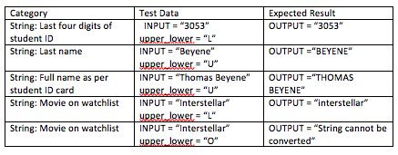
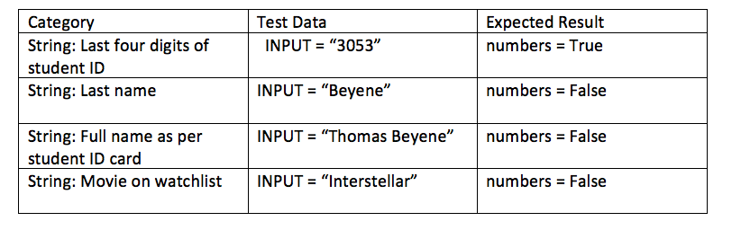
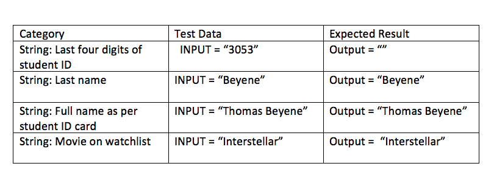

ISAD1000 Introduction to Software Engineering – Exercise Submission

Name: Thomas Beyene
Student ID: 20213053
Practical Class: Friday 8-10am
Venue: Building 314, Room 218

Introduction:

For my assignment I have implemented the Category 1 and Category 2a. I have implemented Category 1 and 2 production code inside the python file ModularityConv, I added extra functionalities to the functions with user input for the Category 1 functionalities and input/outfile txt file for Category 2a. To test the test designs I have used black box testing for all functionalities and white box testing for Category 1a and 1c. 

Modularity:

Once the program started, menu options are displayed, the user can make a selection from from option 1 to 5 for the functionalities. The menu has a range of functionalities that user can select from. It run through a loop that takes in the user's input and passes it into the function and returns the output and menu options again and provides the user to have anther opportunity to enter their input if they entered is invalid. To exit the program by entering 0.

The programs achieves high cohesion as the code that can be easily reused. This is shown in the removeNumericNConvert function reusing the removeNumeric() function. Some functionalities from each category will have many functions within it that it calls upon. This is to avoid poor cohesion within the code.

Use of parameters and return values within functions to avoid global variables. It results in an increase in coupling however there isn’t a high number of parameters (max. 2) for each functions.

Checklist:
Are each functionality is defined as a separate function? 
Yes - each functionality has their own function

Is the code well organised in terms of placement of components?
Yes

Are functions using return values?
Yes

Are there any variables that have not been initialised?
No

Are functions performing its task without any errors?
Yes

Is there any repeated and unneccessary code?
Yes in RemoveNumericAndConvertOption() - can call the convertString() function inside it instead of having repeated code. 

Are there any global variables?
No

Refactoring was done for RemoveNumericAndConvertOption function. Firstly I created a function called RemoveNumericAndConvert which takes in variables and is called in the RemoveNumericAndConvertOption function. Additionally I modified the ConvertLengthOption(), by writing a function for the conversion of lengths called ConvertLength() and separating the write and read operations into the ConvertLengthOption where it can call the ConvertLength() function.

Module description:

convertString(INPUT, upper_lower)
This function takes in an INPUT and an option of ‘U’ or ‘L’
The input string is converted by the option ‘U’ or ‘L’, which converts the string to uppercase or lowercase respectively 
The module returns the result OUTPUT, which displays the converted string. 

convertStringOption()
The functions takes in user input, which firsts asks the user want to convert the string uppercase or lowercase, then it prompts the users to enter a string to convert. It then run the convertString function. If a string that is entered is invalid then the program is unable to convert the string. 

ContainsNumbericValue(INPUT)
   The function takes in an inputString which checks if it contains numeric values from the range of 0 to 9 which is stored in a list. It then return a Boolean value of True if the string contains a numeric value, otherwise it would return a False statement

ContainsNumbericValueOption()
The function takes in user input, which firsts prompts the user to enter a string, then performs the ContainsNumbericValue() function. If the string entered contains numeric values then it prints the statement "The string contains numeric value." If it doesn’t then it prints the statement "The string does not contain numeric value." 

IsValidNumber(INPUT)
The function check if all characters in INPUT contain numeric values of the range 0 to 9 which is stored in a list. It then return a Boolean value of True if the string contains a numeric value, otherwise it would return a False statement.

IsValidNumberOption()
The function takes in user input, which firsts prompts the user to enter a string, then performs the ContainsNumbericValue() function. If the string entered contains numeric values then it prints the statement "The string is the valid." If it doesn’t then it prints the statement "The string is not valid."
 
RemoveNumeric(INPUT)
This functions loops through each character in the string and checks if there are digits. If it is not a number than the string is added to the output string. The result output string will be the input string without numbers. The return value is string after removing any numeric values

RemoveNumericAndConvert(INPUT, upper_lower)
This functions loops through each character in the string and checks if there are digits. If it is not a number than the string is added to the output string. The result output string will be the input string without numbers. It then prompts to convert the string uppercase or lowercase. The return value is string after removing any numeric values, also converted to either uppercase or lowercase based on the user choice.

 
RemoveNumericAndConvertOption()
The function takes in user input, which firsts prompts the user to enter a string, the string goes through the RemoveNumeric(inString) function, that checks if there are digits and remove them. It then prompt user for input to convert the newly modified string to be uppercase or lowercase.

ConvertLength(length, measurement):

This module takes in a float value for the length and an integer from the range of 1 to 4 that represents the length measurement. The length measurements are represented by 1 being metres will be converted to feet, 2 being feet will be converted to metres, 3 being centimetres will be converted to inches and 4 being inches will be converted to centimetres.
It then passes through the conversion into the output variable and returns output.

ConvertLengthOption(): 
This function takes in an input file that contains a  that represents a length value as a float and operates on each line of the file. For each line, the length values are converted firstly from metres are converted to feet, then feet to metres, centimetres to inches and inches to centimetres. These values are written into the output file.

Each function will ask the user whether or not they'd like to input data in the form of a string through their keyboard or through the reading of a data file. 

Category 1: For Category 1 the functionalities performs string conversions. 

Converting a given string to upper case or lower case. 
The functionality operates by taking in a string and converting the letter to either uppercase or lowercase.  
The functionality should only accept letters and ignore special characters and numbers

Identify whether a given string is a valid number or not.  - The functionality operates by taking in a string and checking if the string only contain a number between 0 to 9. 
The program will then display a message of whether the string is valid or the string is not valid

Identify whether numeric values are in a given string. 
 The functionality operates by taking and check if there are any numbers within the string
the program will display a message of whether there was or wasn't a number within the string

Remove any numeric values in a given string and then convert the string to upper case or lower Case. The functionality operates by taking in a string and remove any numbers within it, after performing that operation it will either convert the string to upper case or lower case.

In Category 2, the functionalities performs conversion of measurements:
Converting a number which represents a length given in meters to feet and vice versa and centimetres to inches and vice versa. 
The functionality operates by taking in an input file in which the conversions meters to feet, feet to meters, centimetres to inches and inches to centimetres are done

Testing:

#Converting a given string to upper case or lower case.

#Equivalence Partitioning:

##Submodule: convertString()
##Imports: INPUT(str), upper_lower(str)
##Exports: OUTPUT (str)

##"Identify whether numeric values are in a given input parameter."

##Submodule: ContainsNumbericValue()
##Imports: INPUT(str)
##Exports: numbers(bool)

##"Identify whether numeric values are in a given string."

##Submodule: RemoveNumeric()
##Imports: INPUT(str)
##Exports: OUTPUT(str)

##"Remove any numeric values in a given string."

